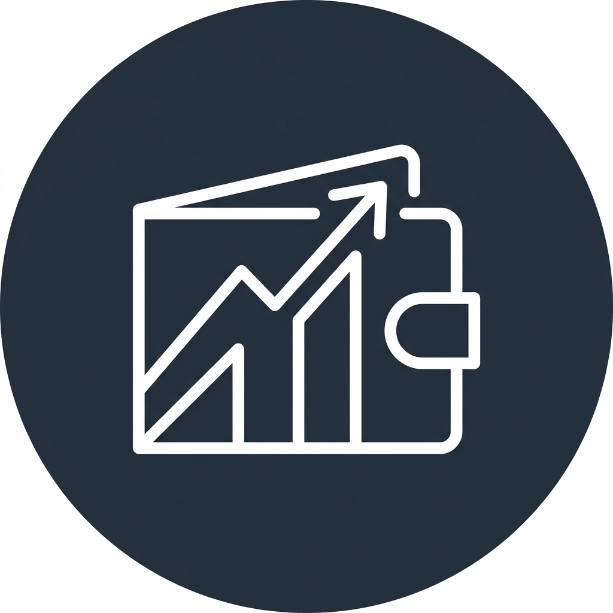

<div align="center">
  
  <h1>Finance Tracker</h1>
  <p>A beautifully designed, offline-first personal finance application.</p>

  <p>
    <a href="https://finlog-phi-seven.vercel.app/" target="_blank">
      
    </a>
    &nbsp;
    <a href="#mobile-app-download">
      
    </a>
  </p>
</div>

---

## 🌟 Overview
**Finance Tracker** is a progressive, offline-capable mobile and web application built with React, Vite, TailwindCSS, and Capacitor. It is designed to be the ultimate companion for tracking your daily expenses, incomes, debts, and budgets seamlessly across all your devices.

## ✨ Features
- **🌐 Offline-First Syncing**: Works perfectly without an internet connection. Your data saves locally and automatically syncs to Firebase the moment you are back online.
- **💼 Multi-Workspace Support**: Separate your finances into custom "Modes" (e.g., Personal, Business, Vacation). Each mode maintains its own isolated budgets and transaction logs.
- **🤝 Lend & Borrow Tracking**: Keep a close eye on money you owe or are owed with a dedicated Debts tracker.
- **📊 Smart Analytics & Budgets**: Visual budget rings and historic spending trends (1 Month, 3 Months, 6 Months, or 1 Year views).
- **🌙 Instant Dark Mode**: Beautiful, persistent dark and light modes with zero flash-of-white on launch.
- **🔒 Security**: Built-in authentication, with the ability to require your password before any transaction deletion. Change your password directly from the settings.
- **📑 Excel Export**: Download perfectly formatted `.xlsx` sheets of your transactions and monthly summaries for your records.
- **📱 Native Mobile App**: Available as a native Android APK built using Capacitor, featuring custom icons, splash screens, and smooth micro-animations.

## 🚀 Getting Started

### Web Application
You can use the app directly in your browser without any installation!
👉 **[Open Finance Tracker Web](https://finlog-phi-seven.vercel.app/)**

### Mobile App Download
Download the standalone native Android app for the best mobile experience:
👉 **[Download APK Here]** *(Link coming soon)*

*(Alternatively, you can open the web link in Chrome on Android and tap "Add to Home Screen" to install it as a PWA).*

## 💻 Tech Stack
- **Frontend Core:** React 19, React Router v7, Zustand (State Management)
- **Styling:** TailwindCSS v4, Lucide React (Icons)
- **Database & Auth:** Firebase Firestore, Firebase Authentication
- **Data Visualization:** Recharts
- **Mobile Bridging:** Ionic Capacitor
- **Build Tool:** Vite, Vite PWA Plugin

## 🛠️ Local Development
If you'd like to run the project locally or contribute:

1. Clone the repository:
   ```bash
   git clone https://github.com/your-username/finance-tracker.git
   cd finance-tracker
   ```
2. Install dependencies:
   ```bash
   npm install
   ```
3. Start the development server:
   ```bash
   npm run dev
   ```
4. Build for Android:
   ```bash
   npm run build
   npx cap sync android
   npx cap open android
   ```

## 🔒 Privacy & Security
Your data is securely stored in Firebase under strict security rules. The application implements standard authentication flows and allows you to put passwords behind destructive actions (like clearing data or deleting transactions).

---
<div align="center">
  <sub>Built with ❤️ for better financial health.</sub>
</div>
